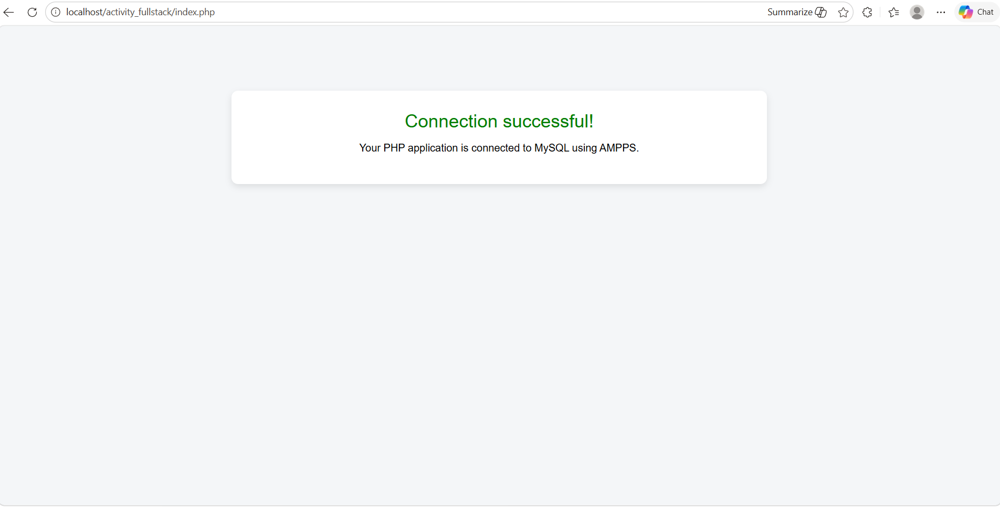

# Activity Fullstack – PHP & MySQL Connection (AMPPS)

## 📌 Project Overview
This project demonstrates how to establish a connection between PHP and a MySQL database using a local AMPPS development environment. The goal is to verify that the server-side script can successfully communicate with the database.

---

## ⚙️ Technologies Used
- PHP
- MySQL
- AMPPS (Apache, MySQL, PHP)
- Visual Studio Code
- Git & GitHub

---

## 📁 Project Structure
activity_fullstack/
│── index.php
│── activity_fullstack.png

---

## 🔧 Setup Instructions

1. Clone the repository:
git clone https://github.com/cmboswell458/activity_fullstack.git

2. Move the project into the AMPPS `www` directory:
C:\Program Files\Ampps\www

3. Start AMPPS:
- Enable Apache
- Enable MySQL

4. Open a browser and navigate to:
http://localhost/activity_fullstack/index.php

---

## 💻 Code Explanation

The `index.php` file:
- Creates a connection using `mysqli`
- Checks for connection errors
- Displays a success or error message
- Closes the database connection

---

## ✅ Expected Output

If configured correctly, the browser will display:

**"Connection successful!"**

---

## 📸 Screenshot

---

## ⚠️ Notes

- Default AMPPS credentials used:
  - Username: `root`
  - Password: `mysql`
- If your password differs, update it in `index.php`

---

## 🎯 Learning Outcome

This project demonstrates:
- How to connect PHP to a MySQL database
- How to use AMPPS as a local development environment
- Basic debugging and testing of server-side scripts
- Version control using Git and GitHub

---

## 🔗 Repository Link
https://github.com/cmboswell458/activity_fullstack

